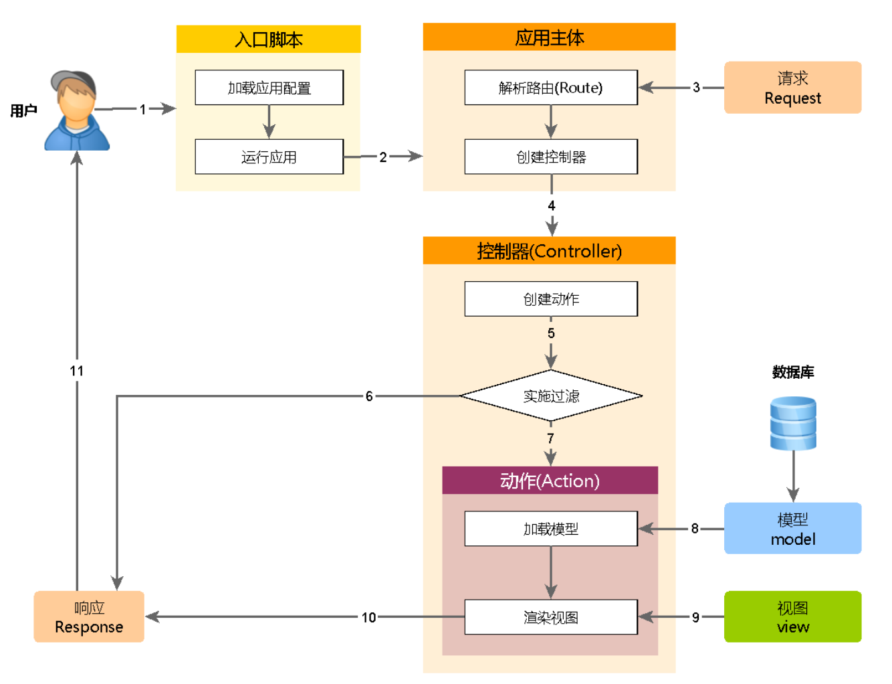
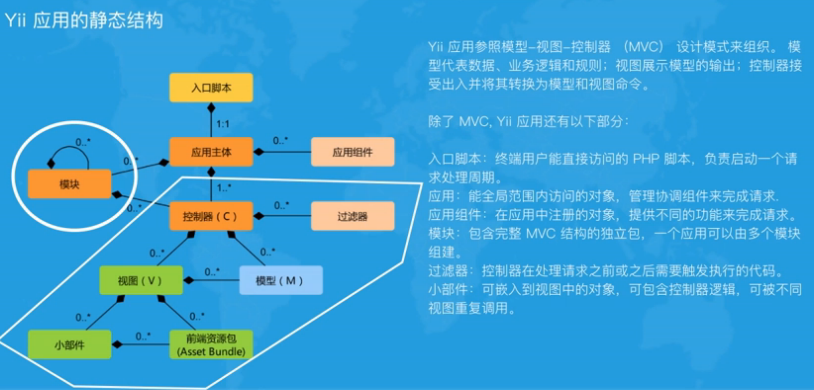
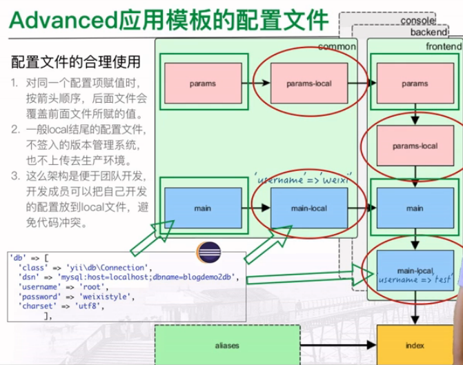
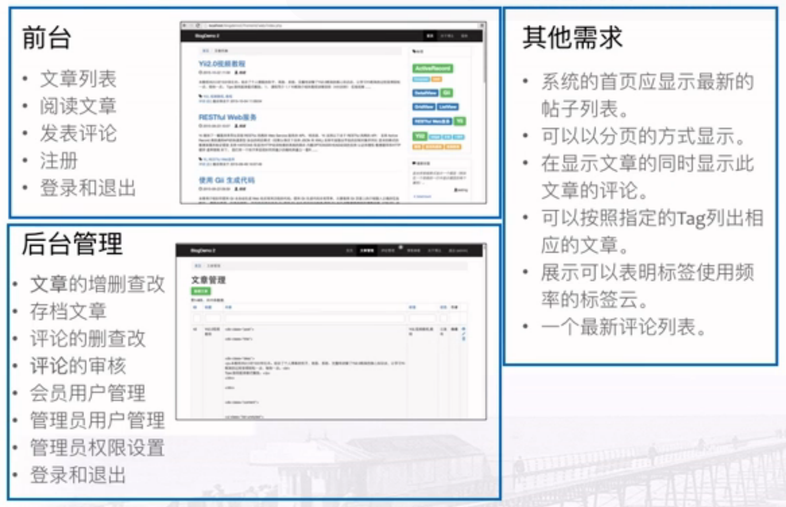
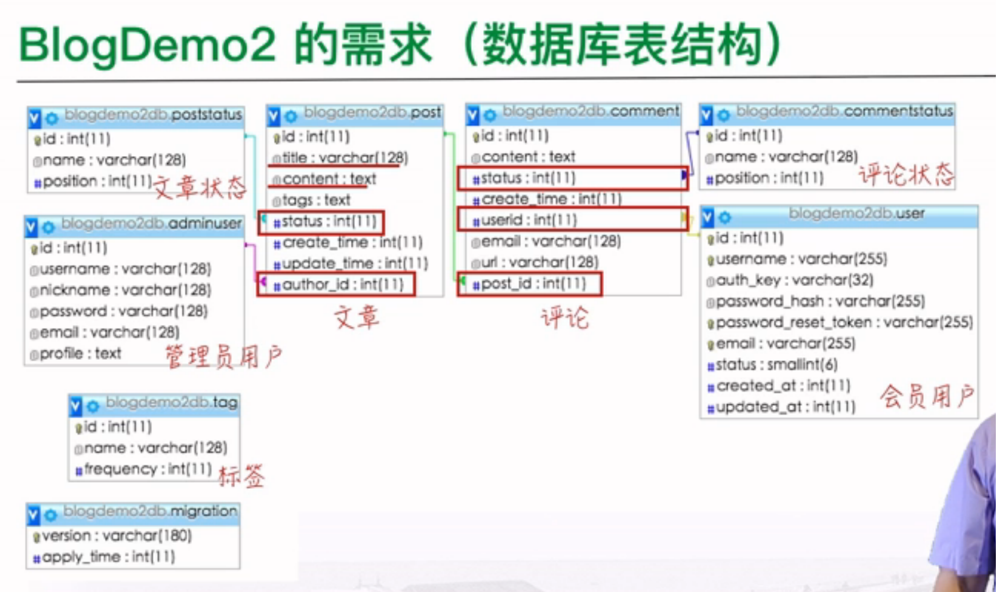

# 认识 Yii2.0
## 什么是 Yii 框架
> 快速、安全、专业的 PHP 框架
最新版本是 2016年4月28日发布的2.0.8版本

## Yii 框架有什么用
> 适合开发 Web2.0 网站。博客、社区网站、SNS、分享服务、内容管理系统、电子商务网站、RESTFULL Web 服务这些应用，Yii框架都是不错的选择

## 为什么要用 Yii 框架
### 开发块
自带丰富的功能，包括 ActiveRecord、缓存、身份验证和 RBAC、脚手架、单元测试这些功能，可显著缩短开发时间

### 代码优雅
Yii 框架严格按照 MVC 设计模式组织代码，清晰分离逻辑层和表示层，代码严谨优雅，可维护性高

### 安全可靠
Yii 框架的措施包括了输入验证、输出过滤、SQL注入和跨站脚本攻击的预防等。

# 准本工作
## 搭建开发环境
- WampServer(PHP 5.4.0+)

## 开发工具
- [eclipse for Developers](http://www.eclipse.org/downloads/packages/)

## 学习资料
- [官方地址](https://www.yiiframework.com)
- [Yii API](https://www.yiiframework.com/doc/api/2.0/)
- [开源项目地址](https://github.com/yiisoft/yii2)
- [《权威指南 The Definitive Guid to Yii 2.0》](http://www.yiichina.com/doc/guide/2.0)
- [《类参考手册 Yii PHP Framework Version 2》](http://www.yiichina.com/doc/api/2.0)

# Yii2.0 安装(Basic 应用模板)
- 代码中查看版本号
`Yii::getVersion()`

- 命令行中版本号
`./yii`

## 1.下载[composer](https://getcomposer.org)
- 命令行安装
```
php -r "copy('https://getcomposer.org/installer', 'composer-setup.php');"
php -r "if (hash_file('SHA384', 'composer-setup.php') === '544e09ee996cdf60ece3804abc52599c22b1f40f4323403c44d44fdfdd586475ca9813a858088ffbc1f233e9b180f061') { echo 'Installer verified'; } else { echo 'Installer corrupt'; unlink('composer-setup.php'); } echo PHP_EOL;"
```

- 提示安装验证成功：Installer verified
```
php composer-setup.php
php -r "unlink('composer-setup.php');"
```

## 2.配置 composer
- [中文composer](https://www.phpcomposer.com)
- [中国全量镜像](https://pkg.phpcomposer.com)

### 有两种方式启用本镜像服务：
- 系统全局配置： 即将配置信息添加到 Composer 的全局配置文件 config.json 中
```
$ php composer.phar config -g repo.packagist composer https://packagist.phpcomposer.com
```

- 单个项目配置： 将配置信息添加到某个项目的 composer.json 文件中，进入你的项目的根目录（也就是 composer.json 文件所在目录），执行如下命令：
`$ php composer.phar config repo.packagist composer https://packagist.phpcomposer.com`

## 3. 安装 Yii2
- [YiiChina](http://www.yiichina.com/download)
- 安装完 Composer，运行下面的命令来安装Composer Asset插件:
`$ composer global require "fxp/composer-asset-plugin:^1.2.0"`

- 安装 Yii 2.0 应用程序模板是一个包含 Yii 写的骨架 Web 应用程序包
`$ composer create-project --prefer-dist --stability=dev yiisoft/yii2-app-basic basic 2.0.14`

- 安装高级的应用程序模板
`$ composer create-project --prefer-dist yiisoft/yii2-app-advanced advanced 2.0.14`

## 4. 从旧版本升级
`$ composer update yiisoft/yii2 yiisoft/yii2-composer bower-asset/jquery.inputmask -vvv`

# Yii 应用
## basic 应用目录
- controllers/ 控制器类
- models/ 模型类
- views/ 视图文件

- commands/ 控制台命令类
- tests/ 测试相关的文件
- assets/ 资源文件

- config/ 应用配置及其他配置
- web/ Web应用根目录
	+ assets/ 资源目录
	+ index.php 应用入口文件

- runtime/ 运行时生成的日志和缓存文件
- vendor/ 框架自身及第三方扩展/安装 Composer
	
- composer.json 描述包信息，Composer 配置
- yii 控制台命令执行脚本


# 配置 Basic 模板
- config/web.php
```
'cookieValidationKey' => '输入安全密钥'
```


# Yii2 运行机制概述
每一次 Yii 应用开始处理 HTTP 请求时，它都会进行一个近似的流程。

1. 用户提交指向 入口脚本 web/index.php 的请求。
2. 入口脚本会加载 配置数组 并创建一个 应用 实例用于处理该请求。
3. 应用会通过 request（请求） 应用组件 解析被请求的 路由。
4. 应用创建一个 controller（控制器） 实例具体处理请求。
5. 控制器会创建一个 action（动作） 实例并为该动作执行相关的 Filters（访问过滤器）。
6. 如果任何一个过滤器验证失败，该动作会被取消。
7. 如果全部的过滤器都通过，该动作就会被执行。
8. 动作会加载一个数据模型，一般是从数据库中加载。
9. 动作会渲染一个 View（视图），并为其提供所需的数据模型。
10. 渲染得到的结果会返回给 response（响应） 应用组件。
11. 响应组件会把渲染结果发回给用户的浏览器。

下面的示意图展示了应用是如何处理一个请求的。



# 入口脚本
1. 入口脚本
- 打开每一个网页的第一个环节
- 一个应用只有一个入口脚本
- 必须放在浏览器能够访问的 Web 服务器目录下上，一般名为 index.php

2. 入口脚本的作用
- 定义全局变量
	+ 标识应用是否运行在调试模式：
		* `defined('YII_DEBUG') or define('YII_DEBUG', true);`
	+ 标识应用运行的环境
		* `defined('YII_ENV') or define('YII_ENV', 'dev');`
- 注册 Composer 自动加载器
	+ `require __DIR__ . '/../vendor/autoload.php';`
- 包含 Yii 类文件
	+ `require __DIR__ . '/../vendor/yiisoft/yii2/Yii.php';`
- 加载应用配置
	+ `$config = require __DIR__ . '/../config/web.php';`
- 创建一个应用实例并配置; 调用 yii\base\Application:run() 来处理请求
	+ `(new yii\web\Application($config))->run()`

## 应用主体
1. 应用主体
- 是管理 Yii 应用系统整体结构和生命周期的对象
- 是 **yii\web\Application** 类的实例
- 可以用 **\Yii::$app** 来访问应用
	+ 有哪些属性和方法？
	+ 有什么用？

2. 应用主体的配置
- $config 变量给应用主体这个对象的属性进行初始化赋值
- $config 变量是从配置文件 web.php 加载而来的

- id 属性区分其他应用的唯一标识 ID
- basePath 指定该应用的根目录
- defaultRoute 默认路由，如何加载控制器 
- component 注册多个在其他地方使用的应用组件
- 'language' => 'zh-cmn-hans', 告诉浏览器 这是一张中文网页


## 控制器 - controller/siteController.php
1. 控制器
- 是 MVC 结构中的 C 这个部分
- 从 **[yii\web\Controller](https://www.yiiframework.com/doc/api/2.0/yii-web-controller)** 继承来
- 负责处理请求和生成响应

2. 组成
- 控制器主要有动作组成
- 动作是控制器类中的方法
- 一个动作对应一个页面

3. [render()](https://www.yiiframework.com/doc/api/2.0/yii-base-controller#render()-detail)
pubic string render( $view, $params = [])

- $view 视图名
- $params 是传给视图的数据
- 返回的是字符串，就是渲染好的结果
- 视图或布局文件不存在时，抛出的异常


## 视图 - views/site/index.php
什么事视图
- 视图是 MVC 模式中 view 这一部分
- 视图是在 yii\web\View 应用组件的帮助下，依据视图模板文件，进行构造和渲染完成的
- 习惯上称视图模板文件为视图
- 视图模板文件主要由 HTML 代码和展示类 PHP 代码组成

1. 导航菜单在哪里？在布局文件里

## 视图的布局
1. 什么是布局
布局是一种特殊的视图，表现多个视图的公共部分

2. 如何创建布局
布局也是视图，向普通视图一样创建布局默认存储在 **@app/views/layouts** 里

3. 如何变换布局
	3.1 创建 @app/views/layouts 目录里创建 wx.php 文件
	3.2 在控制器的方法中 指定布局文件
```
public function actionIndex(){
	$this->layout = 'wx';
	// $this->layout = false; 代表不使用布局页面
	// 不指定$this->layout 默认会调用 main.php 布局页面
	return $this->render('index');
} 
```
	3.3 指定布局另一种方式就是在控制器类设置属性 **public $layout = '布局名';**
	
4. 布局文件的数据
$this 和 $content
- $this 指向 [yii\web\View](https://www.yiiframework.com/doc/api/2.0/yii-web-view) 来管理和渲染这个视图文件

- $this->beginPage() 布局开始出调用
- $this->head() 在 head 标签中调用
- $this->beginBody() 在 body 标签的开始出调用
- $content 是视图模板文件渲染出来的结果 
- $this->endoBody() 在 body 标签结束出调用
- $this->endPage() 布局结尾出调用

## 模型
```
public function actionContact()
{
	// 创建 ContactForm 对象
	$model = new ContactForm();
	/**
		* 1. 表单调教的数据赋值给 $model?
		* 2. 能否成功执行 $model 的 contact 方法
		* 3. 设置提交标志
		*/
	if ($model->load(Yii::$app->request->post()) && $model->contact(Yii::$app->params['adminEmail'])) {
		Yii::$app->session->setFlash('contactFormSubmitted');

		// 页面刷新
		return $this->refresh();
	}
	return $this->render('contact', [
		'model' => $model,
	]);
}
```

1. 什么是模型
- 模型是 MVC 模式中的一部分，是表现业务数据，规则和逻辑的对象
- 可通过继承 yii\base\Model 或它的子类定义模型类，基类 yii\base\Model 支持许多使用的特性
- 属性：表现业务数据，可想普通类属性或数组一样被访问
```
public $name;
public $email;
public $subject;
public $body;
public $verifyCode;
```

- 属性标签：指定属性显示出来的标签
```
public function attributeLabels()
{
		return [
				// 'verifyCode' => 'Verification Code',
				'name' => '姓名',
				'email' => '邮箱',
				'subject' => '主题',
				'body' => '内容',
				'verifyCode' => '验证码',

		];
}
```

- 块赋值：支持一步给许多属性赋值
- 验证规则：确保输入数据符合所申请的验证规则
```
public function rules()
{
		return [
				// name, email, subject and body are required
				[['name', 'email', 'subject', 'body'], 'required'],
				// email has to be a valid email address
				['email', 'email'],
				// verifyCode needs to be entered correctly
				['verifyCode', 'captcha'],
		];
}
```

- 数据导出：允许模型数据导出为自定义格式的数组 Model 类也是更多高级模型如 Active Recored 活动记录的基类


2. 属性的定义和访问
```
$model = new ContactForm();
$model['name'] = 'weixin';
echo $model['name'];
```

3. 块赋值
只用一行代码将用户所有的表单输入填充一个模型，非常方便

4. 验证规则
当模型接收到终端用户输入的数据，数据应当满足某种规则（称为验证规则，也称为业务规则）
可调用 [yii\base\Model::validate()](https://www.yiiframework.com/doc/api/2.0/yii-validators-validator) 来验证接收到的数据


- 让用户能和网站站长沟通，用户把自己的意见填表提交
1. 填写得格式都符合要求了，系统吧意见通过邮件发送给站长
2. 如果不符合，提交错误，并让用于改好再提交

1. 用户需要提交姓名，邮箱，邮件主题和内容等数据 - **业务数据**
2. 用户填数据页面
3. 收集用户提交的数据
4. 数据要有一些判断，比如邮件地址是否合法，必填字段是否已填，等等这些规则 - **业务规则**
5. 收集到这些数据后，要有一个发送邮件的功能，能把信息发送给站长


** 业务逻辑 = 业务数据 + 业务规则**

## 表单
`$model->load(Yii::$app->request->post())`
$model 的load 如何赋值数据


1. 表单的创建
在 Yii中通过 yii\widgets\ActiveForm 来创建表单
- ActiveForm::begin() 不仅创建了一个表单实例，同时也标志着表单的开始
- 放在 ActiveForm::begin() 与 ActiveForm::end() 之间的所有内容都被包含在 HTML 的 <form> 标签中
- 中间是通过调用 ActiveForm::field() 方法来创建 ActiveField 实例，这个实例会创建表单元素与元素的标签，以及对应的 **JavaScript 验证**。

2. [ActiveField](https://www.yiiframework.com/doc/api/2.0/yii-widgets-activefield) 对象的使用
```
<?= $form->field($model, 'name')->textInput(['autofocus' => true]) ?>
<?= $form->field($model, 'email') ?>
<?= $form->field($model, 'subject') ?>
<?= $form->field($model, 'body')->textarea(['rows' => 6]) ?>
<?= $form->field($model, 'verifyCode')->widget(Captcha::className(), [
		'template' => '<div class="row"><div class="col-lg-3">{image}</div><div class="col-lg-6">{input}</div></div>',
]) ?>
```

3. 额外的标签的处理
表单中，存在一些和模型对象没有关系的、额外的 HTML 标签，比如 submitButton 
- 使用纯 HTML
`<button type="submit" class="btn btn-primary" name="contact-button">Submit</button>`
- 使用 [yii\helpers\Html](https://www.yiiframework.com/doc/api/2.0/yii-helpers-html) 帮助类中的方法来添加到表单中
`<?= Html::submitButton('Submit', ['class' => 'btn btn-primary', 'name' => 'contact-button']) ?>`

4. 块赋值
- input 中的 name, 实际是以对象名来命名的一个数组，数组的键对应模型的属性。
`<input type="text" id="contactform-name" class="form-control" name="ContactForm[name]" autofocus>`
- 模型执行 load方法，就是对每个属性执行这样一句赋值
`$model->name = isset($ContactForm['name']) ? $ContactForm['name']:null;`


### Html 帮助类
1. 解决什么问题
通过字符串链接来生成动态的 HTML 会容易变得凌乱
<?= '<p class="username">'. $user->name. '</p>'; ?>

2. 什么是 Html 帮助类
HTML 帮助类提供了很多静态方法，这些方法可以根据参数不同，生成各种 HTML 标签的代码，包括这些标签的属性和内容。
<?= Html::tag('p', Html::encode($user->name), ['class'=>'username']) ?>





# 创建博客

1. 导入数据库文件
2. 控制台执行：`php init` 选择 development 
3. common/config/main-local.php 配置数据库
```
'dsn' => 'mysql:host=localhost;dbname=blog',
'username' => 'root',
'password' => '',
```
4. 控制台执行：`php yii migrate` 生成用户表和迁移表
5. 分别配置前段和后端
- 配置虚拟主机
```
<VirtualHost *:80>
    Servername user.blog.com
    DocumentRoot "C:\development\Yii2Tutorials\blog\frontend\web"

    <Directory "C:\development\Yii2Tutorials\blog\frontend\web">
        Options Indexes FollowSymLinks Includes ExecCGI  
        AllowOverride All  
        Require all granted  

       # use mod_rewrite for pretty URL support  
       RewriteEngine on  

       # If a directory or a file exists, use the request directly  
       RewriteCond %{REQUEST_FILENAME} !-f  
       RewriteCond %{REQUEST_FILENAME} !-d  

       # Otherwise forward the request to index.php  
       RewriteRule . index.php  
  
       # use index.php as index file  
       DirectoryIndex index.php  
  
   </Directory>  
</VirtualHost>
<VirtualHost *:80>
    Servername admin.blog.com
    DocumentRoot "C:\development\Yii2Tutorials\blog\backend\web"

    <Directory "C:\development\Yii2Tutorials\blog\backend\web">
        Options Indexes FollowSymLinks Includes ExecCGI  
        AllowOverride All  
        Require all granted  

       # use mod_rewrite for pretty URL support  
       RewriteEngine on  

       # If a directory or a file exists, use the request directly  
       RewriteCond %{REQUEST_FILENAME} !-f  
       RewriteCond %{REQUEST_FILENAME} !-d  

       # Otherwise forward the request to index.php  
       RewriteRule . index.php  
  
       # use index.php as index file  
       DirectoryIndex index.php  
  
   </Directory>  
</VirtualHost>
```
- 配置本地域名 : `127.0.0.1 user.blog.com admin.blog.com`

## Advanced 模板的目录结构
- common 前后台公用的模型文件
- console 控制台入口用来控制台执行的程序，比如放一些定时执行的程序，或者需要在底层的操作系统上运行的功能
- environments 环境配置文件
- frontend/backend 前后台入口，相当于单独的 Basic 应用，有自己额mvc目录，配置文件目录，入口文件的目录
	+ assets 资源文件目录
	+ web 入口文件目录
	+ config 配置文件目录
	+ models 
	+ controllers
	+ views
	+ runtime 

## Advanced VS Basic
- Advance 版本的增强
	+ 前后台分离
	+ 建好了给予数据库连接的用户模型，并实现了对这个用户模型的认证
	+ 写好了注册，重置密码等功能

- Advanced 相当与含2个 Basic
	+ Advanced 模板具有 Basic 模板的所有功能
	+ 可以当 Advanced 版应用里面有2个 basic 版应用，分别是前台和后台。并且它们之间可以有联系

## Advanced 模板中的别名
1. 别名
别名用来表示文件路径和 URL，目的是避免了代码中硬编码一些绝对路径和URL。一个别名必须以 @ 字符开头。


2. 别名的设置
用 Yii::setAlias() 方法来设置。例如： @app/common/config/bootstrap.php

```
// 文件路径的别名
Yii::setAlias('@foo', '/path/to/foo')

// URL 的别名
Yii::setAlias('@bar', 'http://www.wovert'.com')

Yii::setAlias('@common', dirname(__DIR__));
Yii::setAlias('@frontend', dirname(dirname(__DIR__)) . '/frontend');
Yii::setAlias('@backend', dirname(dirname(__DIR__)) . '/backend');
Yii::setAlias('@console', dirname(dirname(__DIR__)) . '/console');
```

3. 别名的使用 @app/common/config/main-local.php
`'viewPath' => '@common/mail'`
```
$cache = new FileCache([
	'cachePath' => '@runtime/cache'
])
```

4. Advanced 模板中已预定义的别名
- @yii : framework directory
- @app : base path of currently running application.
- @common : common directory
- @frontend : frontend web application directory.
- @backend : backend web application directory.
- @console : console directory
- @runtime : runtime directory of currently running web application.
- @vendor : Composer vendor directory.
- @web : base URL of currently running web application.
- @webroot : web root directory of currently running web application.








# gii 创建博客原型
## 什么是 gii
> gii 是基于 web 的代码生成器，可以用来生成模型，控制器，表单，增删查改等等这些类或功能的代码

## 如何使用 gii
1. backend/common/config/main-local.php 启用 gii 模块
```
if (!YII_ENV_TEST) {
	// configuration adjustments for 'dev' environment
	$config['bootstrap'][] = 'debug';
	$config['modules']['debug'] = [
		'class' => 'yii\debug\Module',
	];

	$config['bootstrap'][] = 'gii';
	$config['modules']['gii'] = [
		'class' => 'yii\gii\Module',
	];
}
```

2. 打开 gii 也买，url?r=gii

## 用 gii 创建博客系统原型

1. 创建模型类 - Model Generator
- Table Name: post
- Model class: Post
- Namespace: common\models

2. 创建 CRUD 页面 - CRUD Generator
- Model Class: common\models\Post
- Search Model Class: common\models\PostSearch
- Controller Class: backend\controllers\PostController
- View path: @app/views/post

- 访问页面：`admin.blog.com/?r=post/index`

3. 修改管理平台菜单 @app/backend/views/layouts/main.php
```
NavBar::begin([
	'brandLabel' => 'Blog',
	'brandUrl' => Yii::$app->homeUrl,
	'options' => [
		'class' => 'navbar-inverse navbar-fixed-top'
	]
]);
$menuItems = [
	[label' => '文章管理', 'url' => ['/post/index']],
	[label' => '评论管理', 'url' => ['/comment/index']],
	[label' => '用户管理', 'url' => ['/user/index']],
	[label' => '管理员', 'url' => ['/adminuser/index']],
];
```


# Yii 如何使用数据库
1. Yii 如何使用数据库
Yii 通过数据库访问对象（Database Access Objects, 简称 DAO）来使用数据库。DAO 建立在 "PHP 数据对象（PDO）"之上，并提供一套面向对象的 API 来访问数据库。

2. 数据库的连接
- 数据库的连接通常放到配置文件中
- 创建一个 yii\db\Connection 对象，并用这个对象来访问数据库
- 这个数据库连接对象的写法：Yii::$app->db

连接不同的数据库，主要是修改 dsn 这个键的值

### 连接不同的数据库
- MySQL/MariaDB: mysql:host=localhost;dbname=dbname
- SQLite: sqlite:/path/to/database/file
- PostgreSQL: pgsql:host=localhost;port=5432;dbname=dbname
- CUBRID: cubrid:dbname=demodb;host=localhost;port=33000
- MS SQL Server(via sqlsrv driver): sqlsrv:Server=localhost;Database=dbname
- MS SQL Server(via dblib driver): dblib:host=localhost;dbname=mydb
- MS SQL Server(via mssql drier): mssql:host=localhost;dbname=mydb
- Oracle: oci:dbname://localhost:1521/mydb


3. 数据库查询[yii\db\Command](https://www.yiiframework.com/doc/api/2.0/yii-db-command)
用 SQL 查询语句来创建一个 yii\db\Command 的对象，调用对象的方法来执行 SQL 查询，返回值是字符型的数组。
```
$posts = Yii::$app->db->createCommand('select * from post')->queryAll();
$post = Yii::$app->db->createCommand('select * from post')->queryOne();

$posts = Yii::$app->db->createCommand('select * from post where id=:id and status=:status')->bindValue(':id', $_GET['id'])->bindValue(':status', 2)->queryAll();
```

- 优点：
	+ 简单，只需要处理 SQL 语句和数组即可
	+ 高效，通过SQL语句来查询数据库非常高效

- 缺点：
	+ 不同数据库系统的SQL语句会有些差别，因此无法做到代码适用于多种数据库系统
	+ 用数组，而没有用到面向对象的方式来管理数据，代码难维护
	+ 如果不小心，会留下 SQL 注入


5. ActiveRecord 和 QueryBuilder 
- 在 DAO 的基础上，更为增强和常用的数据库访问方法


# ActiveRecord
> 活动记录，简称 AR 类提供了一套面向对象接口，用以访问数据库中的数据。
- 一个 AR 类关联一张数据表，每个 AR 对象对应表的一行
- AR 对象的属性，对应为数据的列
- 可以直接以面向对象的方式操作数据库的数据，不需要写 SQL 语句就能实现数据库的访问


## 1. 声明 ActiveRecord 类
> 通过继承 [yii\db\ActiveRecord](https://www.yiiframework.com/doc/api/2.0/yii-db-activerecord) 基类来声明一个 AR 类，并实现 tableName 方法，返回与之相关联的数据库的名称
```
class Post extends \yii\db\ActiveRecord {
	public static function tableName() {
		return 'post';
	}
}
```

## 2. 查询数据
> AR 提供了两种方法来构建 DB 查询，**返回 AR 对象**

### yii\db\ActiveRecord::find()
```
// 只查询一条数据
$model = Post::find()->where(['id'=>32])->one();

// findOne 是 find()->one() 的快捷方式
$model = Post::findOne(1); // 主关键字 id值为 1

// 查询多条数据
$models = Post::find()->where(['status'=>2])->all();
$model = Post::findAlll(['status'=>2]);
```

- [ActiveQueryInterface](https://www.yiiframework.com/doc/api/2.0/yii-db-activequeryinterface) 常用方法
	+ all() 执行查询，并返回 AR 对象
	+ one() 执行查询，并返回 AR 对象
	+ where() 查询条件
	+ orWhere()
	+ andWhere()
	+ orderBy(), addOrderBy() 排序
	+ count() 返回符合查询条件中的记录数
	+ limit() 取出查询结果的条数
	+ with() 指定关联表的字段

- where 参数写法 | SQL 语句
	+ ['and', 'id=1','id=2'] | id=1 and id=2
	+ ['or', 'id=1','id=2'] | id=1 or id=2
	+ ['in', 'id', [1,2,3]] | in (1,2,3)
	+ ['between', 'id', 1, 10] | id between 1 and 10
	+ ['like', 'name', ['test',sample']] | name like '%test%' and name like '%sample%'
	+ ['>=', 'id', 10] | id >=10
```
$posts = Post::find()
	->where([
			'and', 
			['status' => 2],
			['author_id' => 1],
			['like', 'title', 'yii2']
		])
	->orderBy('id')
	->all();
```

### yii\db\ActiveRecord::findBySql()
```
$sql = 'select * from post where status=1';
$posts = Post::findBySql($sql)->all();
```
**注意 findBySQL 返回的对象**

## 3. 访问列数据
AR 对象的属性，对应为数据行的列
```
$model = Post::findOne(1);
echo $model->id;
echo $model->title;

$models = Post::findAll(['status'=>1]);
foreach($models as $model) {
	echo $model->id;
	echo $model->title;
}
```

## 4. 操作数据 CRUD
- 插入：yii\db\ActiveRecord::insert()
- 删除：yii\db\ActiveRecord::delete()
- 更新：yii\db\ActiveRecord::update()
- 插入/更新：yii\db\ActiveRecord::save()


### Create
```
$customer = new Customer();
$customer->name = 'James';
$customer->email = 'james@qq.com';
$customer->save(); // 等同于 $customer->insert();
```

### Read
```
$customer = Customer::findOne($id);
```

### Update
```
$customer = Customer::findOne($id);
$customer->email = 'new@qq.com';
$customer->save();
```

### Delete
```
$customer = Customer::findOne($id);
$customer->delete();
```

# 小部件

## 1. 数据小部件
> 提供了一套数据小部件 widgets, 这些小部件可以用于显示数据

- DetailView 小部件用于显示一条记录数据
- ListView 和 GridView 小部件能够用于显示一个拥有分页、排序和过滤功能的一个列表或者表格

## 2. [DetailView](https://www.yiiframework.com/doc/api/2.0/yii-widgets-detailview)
> 用来显示一条记录的详情
- 一个 Model 模型类对象的数据
- ActiveRecord 类的一个实例对象
- 由键值对构成的一个关联数组

## 3. DetailView 的创建
- 调用 DetailView::widget 方法
- model 可以是一个模型类的实例，也可以是一个数组
- atrributes 属性决定显示模型的那些属性以及如何格式化显示

1. 面包屑修改 Home => 首页
- @app/config/main-local.php
```
$config = [
	'language'=>'zh-CN',
]
```

2. 修改外联数据 - @app/controllers/PostController.php
```
public function getComments()
{
	return $this->hasMany(Comment::className(), ['post_id' => 'id']);
}
/**
 * 
 * 建立文章类和文章状态类关系 
 */
public function getStatus0()
{
	// Poststatus::className() 文件状态表名
	// 关联条件：Post status 字段对应 PostStatus 的id 字段
	return $this->hasOne(Poststatus::className(), ['id' => 'status']);
}
```

```
$thePost = Post::findOne($id);
echo $thePost>status0->name;
print_r($thePost->comments);
```

- hasOne 用于 N 对1，1对1
- hasMany 用于 1 对 N

- gii 会根据数据表之间的关联关系，自动生成建立类之间的关系的代码

- DetailView 修改
```
<?= DetailView::widget([
	'model' => $model,
	'attributes' => [
		'id',
		'title',
		'content:ntext',
		'tags:ntext',
		[
			'label' => '状态',
			'value' => $model->status0->name
		],
		[
			'attribute' => 'create_time',
			'value' => date('Y-m-d H:i:s', $model->create_time)
		],
		[
			'attribute' => 'update_time',
			'value' => date('Y-m-d H:i:s', $model->update_time)
		],
		[
			'attribute' => 'author_id',
			'value' => $model->author->nickname
		]
	],
	// 记录行模板格式
  'template' => '<tr><th style="width:120px">{label}</th><td>{value}</td></tr>'
]) ?>
```

# dropDownList()
```
// 1. 方法1
<?= $form->field($model, 'status')->dropDownList([
	1 => '草稿',
	2 => '已发布'
], ['prompt' => '请选择状态']) ?>

// 2. 方法2：调用文章状态类
$psObjs = Poststatus::find()->all();
$allStatus = ArrayHelper::map($psObjs, 'id','name');
<?= $form->field($model, 'status')->dropDownList($allStatus, ['prompt' => '请选择状态']) ?>

// 3. 方法3：
$sql = 'select id,name from poststatus';
$psObj = Yii::$app->db->createCommand($sql)->queryAll();
$allStatus = ArrayHelper::map($psObjs, 'id','name');

// 4. 方法4
$allStatus = (new \yii\db\Query())
	->select(['name','id'])
	->from('poststatus')
	->indexBy('id')
	->column();

// 5. 方法5
$allStatus = Poststatus::find()
	->select(['name','id'])
	->orderBy('position')
	->indexBy('id')
	->column(),

```

## [ArrayHelper](https://www.yiiframework.com/doc/api/2.0/yii-helpers-arrayhelper) 助手类
> 提供静态方法

- 获取值 (getValue)
```
class User {
	public $name = 'Alex';
}
$array = [
	'foo' => new User()
];
$value = isset($array['foo']['bar']->name)?$array['foo']['bar']->name : null;

// ArrayHelper
$value = ArrayHelper::getValue($array.'foo.bar.name');
```
- 获取列(getColumn)
多维数组或者对象数组中获取某列的值
```
$data = [
	['id' => '123', 'data' => 'abc'],
	['id' => '345', 'data' => 'def']
];
$ids = ArrayHelper::getColumn($data, 'id'); // ['123','345']
```
- 建立应声表(map)
```
$array = [
	['id'=>'123', 'name'=>'aaa','class'=>'x'],
	['id'=>'124', 'name'=>'bbb','class'=>'x'],
	['id'=>'315', 'name'=>'ccc','class'=>'z'],
];
$result = ArrayHelper::map($array, 'id','name'); ['123'=>'aaa',...]
```

- 检查键名的存在 keyExists
```
if (!ArrayHelper::keyExists('username', $data1, false)
```
- 重建数组索引 index
```
$result = ArrayHelper::index($array, 'id');
```
- 多维排序 multisort
```
ArrayHelper::multisort($data, ['age', 'name'], [
	SORT_ASC, SORT_DESC
]);
```

- 检测数组类型 isIndexed
```
echo ArrayHelper::isIndexed($indexed);
```

- HTML 编码和解码值
```
$encoded = ArrayHelper::htmlEncode($data);
$encoded = ArrayHelper::htmlDecode($data);
```

- 合并数组 merge
```
$result = ArrayHelper::merge($a1, $a2);
```

- 对象转换为数组
```
$data = ArrayHelper::toArray($posts, [...]);
```

- 数组检测
```
ArrayHelper::isIn('a', ['a']);
ArrayHelper::isIn('a', new(ArrayObject['a']));
ArrayHelper::isSubset(new(ArrayObject(['a','c'])));
new(ArrayObject(['a','b','c']))
```

# 查询构建器 QueryBuild

## 1. What QueryBuilder
建在在 DAO 基础上，可以创建程序化的、DBMS无关的SQL语句，并且创建的SQL语句，比原生的SQL语句更易读、更安全

## 2. Use QueryBuild
1. 构建查询。创建一个Yii\db\Query 对象来代码一条 select sql 语句，然后通过调用一套可以串起来的方法，比如 select 方法，from 方法，where 方法等这些方法，构建出可以满足一定要求得查询条件。

2. 执行查询。执行 yii\db\Query 的一个查询方法从数据库当中检索数据。例如：all(),one(),column() 等这些查询方法。

```
$row = (new \yii\db\Query())
->select(['id','email'])
->from('user')
->where(['last_name' => 'Smith'])
->orderBy(id)
->limit(10)
->indexBy(id)
->all()
```

### select() 方法
使用字符串或一个数字来指定需要查询的字段
- $query->select('id, email');
- $query->select(['id, email']);
- $query->select('user.id AS user_id, email');
- $query->select("[CONCAT(first_name, ' ', last_name) AS full_name", 'email']);

### 子查询
```
select id, (select count(*) from user) as count from post
$subQuery = (new Query())->select('count(*)')->from('user');
$query = (new Query())->select(['id', 'count' => $subQuery])->from('post');
```

### 可以调用 yii\db\query:addSelect() 方法来选取附加字段
```
$query->select(['id','username'])->addSelect(['email]);
```

### 没有调用 select()方法，那么选择的将是'*'


### from() 方法
- from() 方法指定 SQL 语句当中的 fromr 子句
```
$query->from('user')
```

- from() 中的表明可包含数据库前缀，以及表别名
```
$query->from(['public.user u', 'public.post p']);
$query->from('public.user u', 'public.post p');
```

- 子查询
```
$subQuery = (new Query())->select('id')->from('user')->where('status'=>1);
$query->from(['u'=>$subQuery]);
```


### where()方法
- 字符串格式：'status=1'
- 键值对数组格式：['status'=>1, 'type'=>2]
- 操作符格式：['like','name','test']
```
$query->where('status=:status')->addParams([':status'=>$status])
```

### orderBy() 方法
```
$query->orderBy([
	'id' => SORT_DESC,
	'name' => SORT_DESC
]);
```
- 字符串来声明，写法像原生的 SQL 语句
```
$Quqery->orderBy('id ASC, name DESC');
```

### limit() 和 offset() 方法
`$query->limit(10)->offset(20)`

### indexBy() 方法
使用关联数组的键值作为索引值


### groupBy() 和 having()
```
$query->groupBy(['id', 'status']);
$query->groupBy(['id','status'])
	->addGroupBy('age');
```

### having()
```
$query->having(['status'=>1]);

// having (status=1) and (age > 30)
$query->having(['status'=>1])->addHaving(['>', 'age', 30]);
```

### join() 和 union()
```
// left join post on post.user_id = user.id
$query->join('LEFT JOIN', 'post', 'post.user_id=user.id');


$query->join($type, $table, $on);
$type: INNER JOIN | LEFT JOIN | RIGHT JOIN
$table: 将要连接的表名称
$on: 连接条件
$params: 与连接条件绑定的参数
```

- union()
```
$q1 = (new \yii\db\Query())
	->select('id, category_id as type, name')
	->from('post')
	->limit(10);
$q2 = (new \yii\db\Query())
	->select('id, type, name')
	->from('user')
	->limit(10);
$q1->union($q2);
```

## 执行查询
- all() 返回一个由行组成的数组，每一行是一个名称和值构成的关联数组
- one() 返回结果集的第一行
- column() 返回结果集的第一列
- scalar() 返回结果集的第一行第一列的标量值
- exists() 返回一个表示该查询是否包含结果集的值
- count() 返回 count 查询的结果
- sum() 返回指定列的和
- average() 返回指定列的平均值
- max() 返回指定列的最大值
- min() 返回指定列的最小值


# 数据库查询总结
- 查询方式						|		构建查询		| 	返回值(all,one方法)
- Command对象					| SQL 语句		| 	数组
- AR的findBySQL方法		| SQL 语句 		| 	对象
- Query 对象			| 查询构造器			| 	数组
- AR的find 方法		| 查询构造器			| 	对象